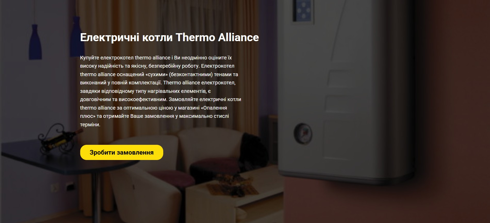
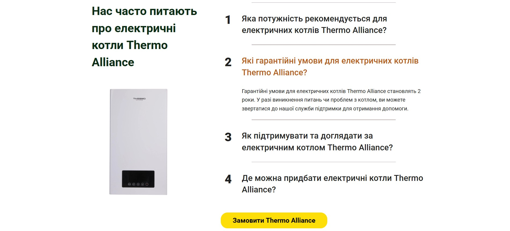

# 🔥 Thermo Alliance — Electric Boilers Landing Page

A promotional one-page website for **Опалення плюс інтернет магазин опалювальної техніки** electric boilers.  
This landing page presents product information and redirects users to the main **Heating Plus** company website for purchases.

---

## ✨ About the Project
The page introduces the advantages of **Опалення плюс інтернет магазин опалювальної техніки** electric boilers — reliability, high efficiency, and durable "dry" heating elements.  
It is designed as part of a marketing campaign to attract potential customers to the main store website.

---

## 🧰 **Technologies Used**

**Frontend**  
- 🧱 **HTML5** — semantic structure and page layout  
- 🎨 **CSS3** — styling and visual presentation  
- 📱 **Responsive Design** — adapted for desktop, tablet, and mobile devices

---

## 🚀 **Features**
- Modern responsive layout  
- Clean and minimalistic UI  
- Integration of interactive elements  
- Easy setup and lightweight performance  

## 📍 Client
**Опалення плюс - online store**

---

## 📸 Screenshots / Demo
  
  

**Live Demo:** [View Website](https://alexmiziuk.github.io/Electro-Boilers/)

---

## 💻 Local Setup
To run the project locally:

```bash
git clone https://github.com/alexmiziuk/Electro-Boilers.git
cd Electro-Boilers

Then simply open the index.html file in your browser.
Alternatively, you can use Live Server in VS Code for a better development experience.
```

---

## 📄 License
MIT License © Oleksandr Miziuk

---

## ✉ Контакты
* **Email:** oleksandr.miziyk@gmail.com
* **GitHub:** [github.com/alexmiziuk](https://github.com/alexmiziuk)